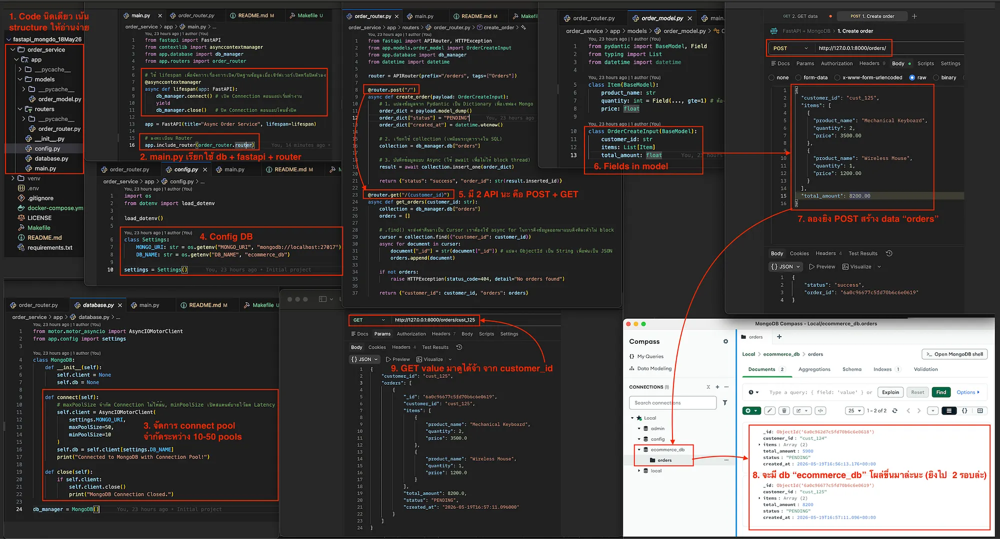
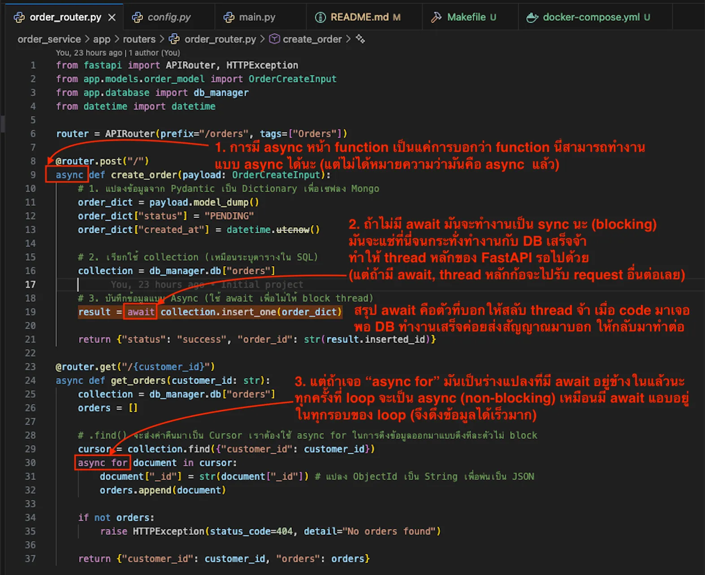
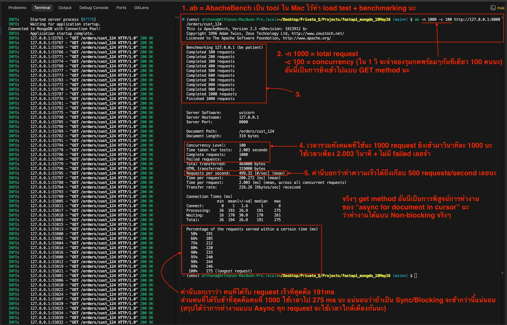

## FastAPI + MongoDB Async: โลกของ Non-blocking + ทดสอบด้วย ab

1. source ./venv/bin/activate
2. pip install -r requirements.txt
3. make up
4. make up-fast                         # Force to use uvicorn from venv na

Ref:
- Medium: https://medium.com/p/2a746b21fc7c
- [Gemini](https://gemini.google.com/u/2/app/8aa7ce8770c6373c?android-min-version=301356232&ios-min-version=322.0&is_sa=1&campaign_id=gemini_overview_page&utm_source=gemini&utm_medium=web&utm_campaign=gemini_overview_page&pt=9008&mt=8&ct=gemini_overview_page&hl=th&_gl=1*1yy5861*_gcl_au*NjAyMDQ5NjQwLjE3NTcyNjA3NzY.*_ga*MTUwMjYzNTY1OC4xNzU3MjYwNzc2*_ga_WC57KJ50ZZ*czE3NTcyNjA3NzYkbzEkZzEkdDE3NTcyNjA3ODIkajU0JGwwJGgw)
